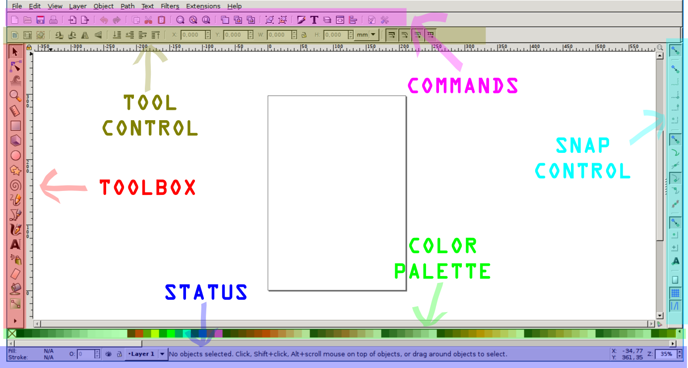
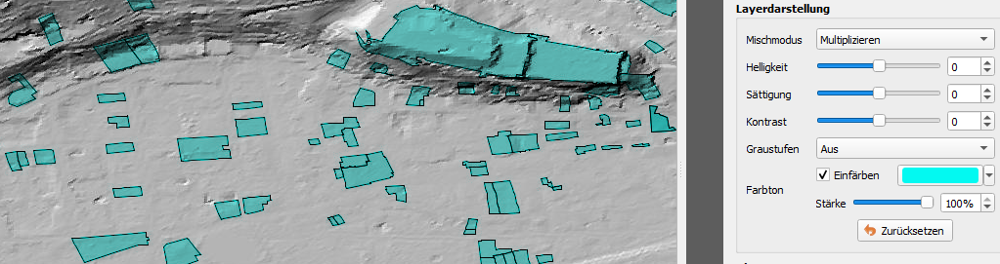
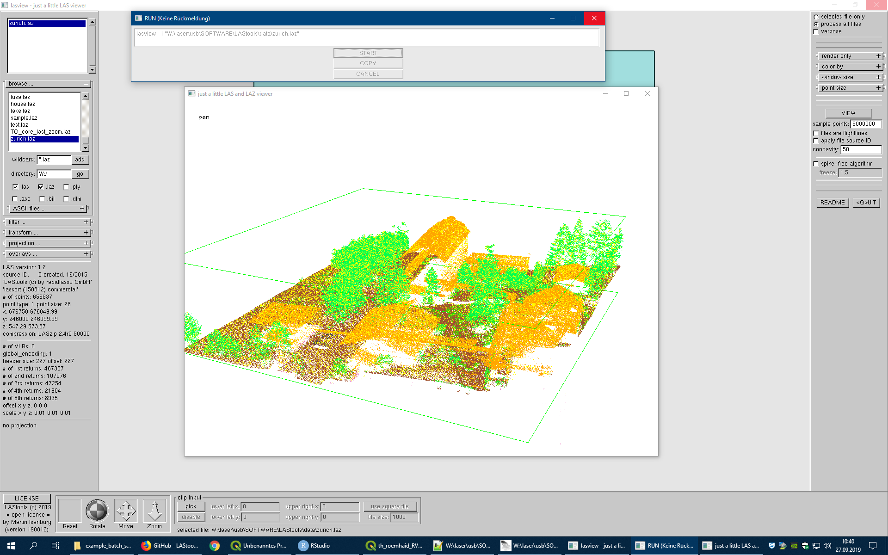

# omg-tldr

Stuff I should have written down a long time before I actually did.

## hardware

* [Raspberry Pi 3 Model B+](pi3B/pi3B.md)

## software

* [Inkscape](inkscape/inkscape.md)  

## gis

* [QGIS](/qgis/qgis.md)

* [LAStools](lastools/lastools.md)

* [Relief Visualization Toolbox](/rtv/rtv.md)

