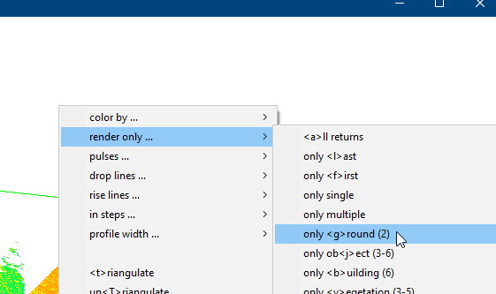
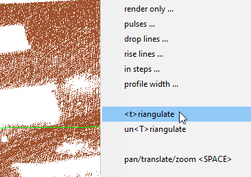
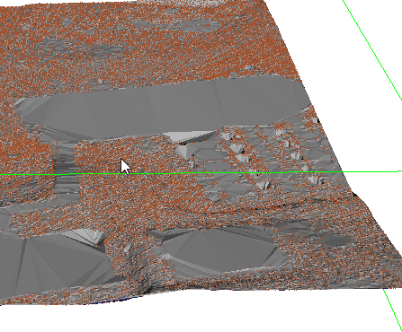
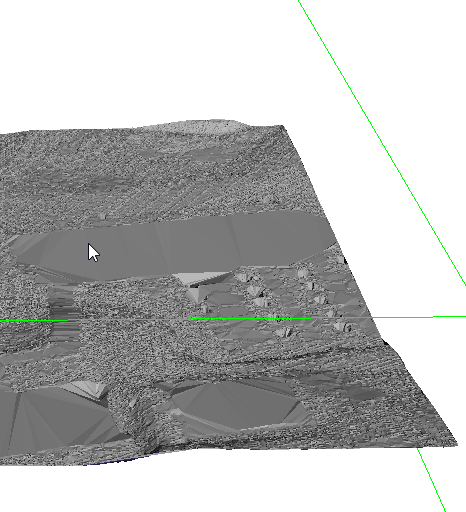
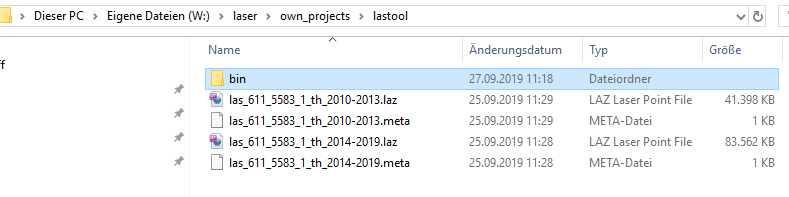
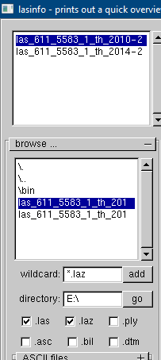
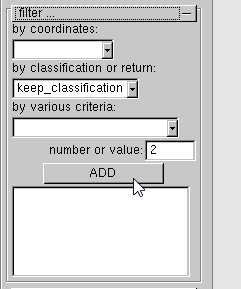
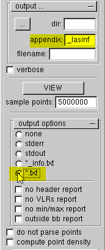
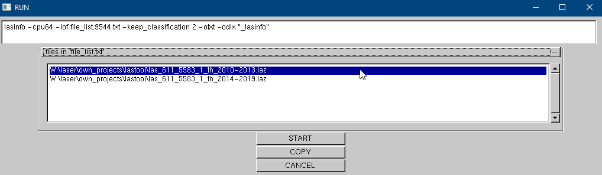

lastools
========

* http://lastools.org/
* https://github.com/LAStools/LAStools


render only ground data



### triangulation








better use batch files


### retrieve meta data 

copy stuff to folder



open lasinfo and add files



drop everything not class 2 (ground)



use meaningful file naming to prevent intense searching afterwards



running the configuration should promt console command, click start to really run




```
lasinfo -cpu64 -lof file_list.9544.txt -keep_classification 2 -otxt -odix "_lasinfo"
```
