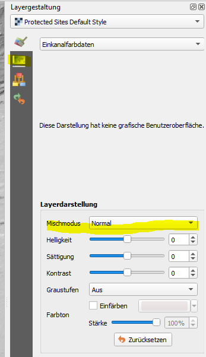

## QGIS
Linux packages are available ``` sudo apt install qgis ```

### gather data 

http://hgis.cartomatic.pl/post/hgis-wms-w-qgis


### basic usage

language change -> settings -> general


new project (don't forget to save)
first data OSM


add world map by writing world to the coordinate field at the bottom


play around with the transparency ot the world map by double kicking the layer 


change the CRS -> project-> properties -> CRS


* important to note here is to use the appropriate spheroid (here 3857 WGS 84)
* if everything fails use gis.stackoverflow.com


### import data 

TODO read WMS wiki

!https://www.geoportal.gov.pl/uslugi/usluga-przegladania-wms

!http://mapy.geoportal.gov.pl/wss/service/img/guest/ORTO/MapServer/WMSServer

get data link 


 


highlight -> add -> close -> wait

-> not working change tactics

!https://www.geoportal.gov.pl/uslugi/usluga-przegladania-wmts
!http://mapy.geoportal.gov.pl/wss/service/WMTS/guest/wmts/ORTO


 


change 

```
http://mapy.geoportal.gov.pl/wss/service/WMTS/guest/wmts/ORTO?SERVICE=WMS&REQUEST=GetCapabilities
```

to

```
http://mapy.geoportal.gov.pl/wss/service/WMTS/guest/wmts/ORTO?SERVICE=WMTS&REQUEST=GetCapabilities
```

because the service was changed and the error is misleading

if everything is working


highlight -> add -> close -> wait


repeat with heigth data
* http://mapy.geoportal.gov.pl/wss/service/WMTS/guest/wmts/ISOK_CIEN

repeat historical German maps but this time check the ignore button for get map capabilities


* http://hgis.cartomatic.pl/page/services
* http://hgis.cartomatic.pl/?tag=/qgis
* http://wms.hgis.cartomatic.pl/topo/2180/m25k?service=WMS&request=GetCapabilities


### bayern services

* https://geoportal.bayern.de/geoportalbayern/seiten/dienste


### thueringen

* use [Geoproxy Freistaat](https://www.geoportal-th.de/Portals/0/Downloads/Geoproxy/Allgemeine%20Beschreibung%20der%20frei%20verf%C3%BCgbaren%20Dienste_WMS_opendata_Geobasisdaten-TLBG.pdf) Thüringen pdf document for further documentation
* http://www.geoproxy.geoportal-th.de/geoproxy/services
* add 1679 DTM and 2032


### multilayermagic

add layer styling toolbox



check for transparency settings set them to no transparency, check the colorize checkbox and select a nice color

 

to make the two layers interact with each other and actualy be usefull change blending mode from **normal** to **multiply**


remember some layers only are displayed at certain scales


### download heigthdata for specific places

* https://www.geoportal-th.de/de-de/
* https://www.geoportal-th.de/de-de/Downloadbereiche/Download-Offene-Geodaten-Th%C3%BCringen/Download-H%C3%B6hendaten

find location you wannt e.g. buchenwald and download the corresponding data


